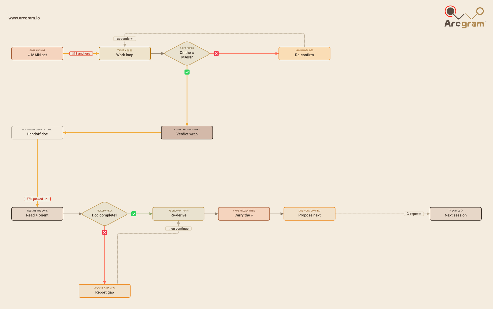

# Throughline

✅ Open source (MIT)  ·  ✅ Model-agnostic — runs in any agent

*Keep the thread — within a session, and across them.*

A small, agent-agnostic skill that keeps work **on-thread** — within a single session, and
across the seam between sessions or agents. (Task Track + Handoff.)

It packages two linked habits:

- **Task Track** (within a session) — an emoji-tagged task list with exactly one **⭐️ MAIN**
  goal anchor, so you can tell at a glance whether you're still solving the main thing or have
  drifted onto a transient.
- **Handoff** (across sessions) — compact the session into a plain-markdown document the next
  agent (any agent, any platform) can pick up cleanly, then re-derive against ground truth
  before trusting it.

**The point that ties them together:** the **⭐️ MAIN tag is the shared goal anchor.** Task Track
holds it *within* a run; the handoff's **⭐️ Goal** carries it *across* runs. One sentence:
**don't lose the thread — within a session, or between them.**

## How the two halves connect



> A single, self-contained SVG — opens in any browser or Markdown viewer, nothing to install.

The red path is the thread: a session's ⭐️ MAIN is written into the handoff's ⭐️ Goal (🔑1),
picked up by the next session (🔑2), re-derived against ground truth (🔑3), and carried forward
as the next ⭐️ MAIN (🔑4) — which loops back (dashed) to begin the cycle again.

## What's in here

| Path | What it is |
|---|---|
| `skills/throughline/SKILL.md` | The skill — the two habits and how they connect. Works as a skill or a paste-in prompt. |
| `.claude-plugin/plugin.json` | Plugin manifest (so it installs as a Claude Code / Cowork plugin). |
| `commands/handoff.md` | The **write** operation: compact a session into a handoff doc. |
| `commands/resume.md` | The **read** operation: pick up a handoff and re-derive before trusting it. |
| `templates/handoff.template.md` | The single source of truth for a handoff's structure. |
| `references/task-track.md` | The within-session discipline, in depth. |
| `references/handoff.md` | The across-session protocol (the five anti-drift mechanisms), in depth. |
| `examples/example-handoff.md` | A filled-in handoff to copy the shape from. |
| `tools/handoff.py` | Optional, zero-dependency helper (scaffold + validate). |
| `assets/logic-flow.svg` | The diagram above. |

## Use it

**As a prompt (any agent — Claude, OpenAI, Gemini, Cursor, Cline, a local model).** Paste the
relevant file into your agent. Nothing assumes a particular platform; every capability degrades
gracefully (no file write → emit inline; no live access → re-derive from the artifacts you have;
no code execution → skip the helper).

**As a skill / slash command (Claude Code, Cursor, etc.).** Drop the folder where your tool reads
skills/commands. Then `handoff` to wrap up and `resume` to pick up.

**The optional helper** (only where you can run code) does the *mechanizable* half — it never
summarizes:

```bash
python3 tools/handoff.py new                 # scaffold a blank handoff from the template
python3 tools/handoff.py check HANDOFF.md    # validate: sections, one ⭐️ MAIN, re-derive note, secret sweep
```

It reads the required sections **from the template at runtime**, so the prompt and the validator
can't drift apart — the skill dogfoods its own single-source-of-truth rule.

## Why it's shaped this way

Long or multi-agent work fails two ways: reasoning drifts off the goal *within* a session, and the
thread gets dropped *between* sessions. The same goal anchor closes both gaps. The handoff is
deliberately *light* — a plain-text artifact, capability-agnostic, with a write side and a read
side — because the next agent might be anyone, anywhere, and a heavy protocol that assumes your
platform is a protocol nobody else can pick up.

## License

MIT — see [`LICENSE`](LICENSE).
