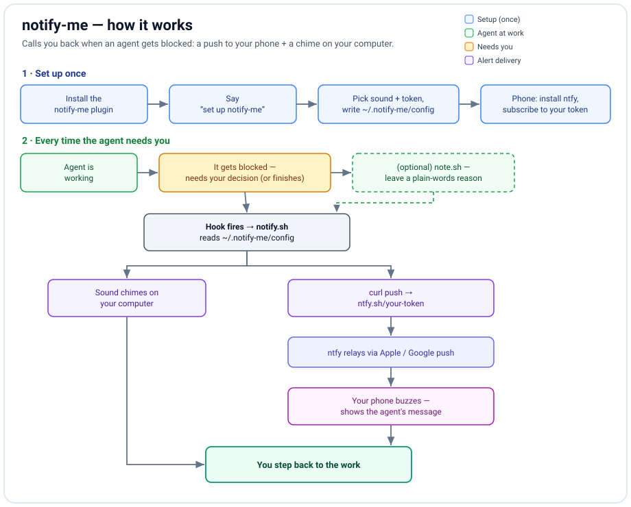

# notify-me

✅ Open source (MIT)  ·  ✅ Works with any agent that supports hooks

**Calls you back when an agent needs you.** The moment an agent gets *blocked* waiting on your
decision (or needs permission to run something), notify-me **pushes a notification to your phone**
and/or **plays a sound on your computer** — so you can step away and still know when you're needed.

Works with any agent that supports plugin hooks. Free, no account, no background process, no residue.



## Quick start

1. **Install** the plugin.
2. Say **"set up notify-me"** — the setup walks you through, in plain chat:
   - **Pick a sound** from the system sounds found on *your* computer (preview before choosing).
   - **Sound on/off** for the local chime.
   - **A private phone token** you choose or have generated.
3. On your phone: install the free **[ntfy](https://ntfy.sh)** app, subscribe to that token, and (optionally) set the phone's alert sound inside the app.
4. A test ping confirms both ends.

That's it. From then on, when the agent gets blocked, your phone buzzes and your computer chimes.

## How it works

A hook fires on two events:

| Event | Meaning | Default |
|-------|---------|---------|
| `Notification` | the agent is blocked / waiting on you | **on** — high-priority push + sound |
| `Stop` | the agent finished a turn | **off** (fires every turn; opt in via `NOTIFY_ON_STOP`) |

Phone delivery uses [ntfy.sh](https://ntfy.sh): the hook sends one `curl` to your private topic;
ntfy relays it through Apple/Google push to the ntfy app on your phone.

## Task-aware messages

By default the push shows a generic line. To make it say, in plain language, *what* the agent needs,
the agent leaves a one-line note right before it pauses:

```
bash "$CLAUDE_PLUGIN_ROOT/scripts/note.sh" "Editing your config — confirm whether to overwrite the old file?"
```

The next push uses that line (in whatever language it's written), then clears it. Message priority is:
explicit note → the agent's own notification text → a generic default.

## Settings — `~/.notify-me/config`

| Field | Meaning | Default |
|-------|---------|---------|
| `TOKEN` | private secret your phone subscribes to (the ntfy app calls it the "topic") | (you choose) |
| `SOUND` | play a local computer sound — `on`/`off` | `on` |
| `SOUND_FILE` | a sound-file path, or `@system` to follow your OS alert sound | a system sound |
| `NOTIFY_ON_STOP` | also alert on turn-end — `on`/`off` | `off` |
| `SERVER` | ntfy server base URL (change only if you self-host) | `https://ntfy.sh` |

A starting template is in [`config.example`](config.example). Change anything later by saying
"change the notify-me sound / token, turn the chime off", etc.

## Good to know

- **Privacy:** on the public ntfy.sh server, the token *is* the password — anyone who knows it can read or send to it. Keep it private, or [self-host ntfy](https://docs.ntfy.sh/install/) and point `SERVER` at it.
- **Phone sound** is set inside the ntfy app per-topic; the computer can't set it remotely.
- **Local sound:** a real sound file is more reliable than `@system`, which follows the separate OS "alert volume" (easy to leave at zero).
- **One honest limitation:** the `Notification` event fires reliably when the agent needs a *tool permission*, and otherwise on an *idle timeout* (~60s). A question typed in chat without a permission request waits for that idle timer rather than firing instantly.

## Platform support

- **Local sound:** macOS (`afplay` / `@system` beep), Linux (`paplay`/`aplay`), Windows (console beep). Auto-detected.
- **Sound picker:** macOS and freedesktop Linux are scanned automatically; on other setups you can supply a path or use `@system`.
- **Phone push:** any platform with `curl`.

## Uninstall

- Remove your settings: `bash scripts/uninstall.sh` (deletes `~/.notify-me`).
- Remove the hook + scripts: disable or uninstall the **notify-me** plugin in your app.

## License

MIT — see [LICENSE](LICENSE).
