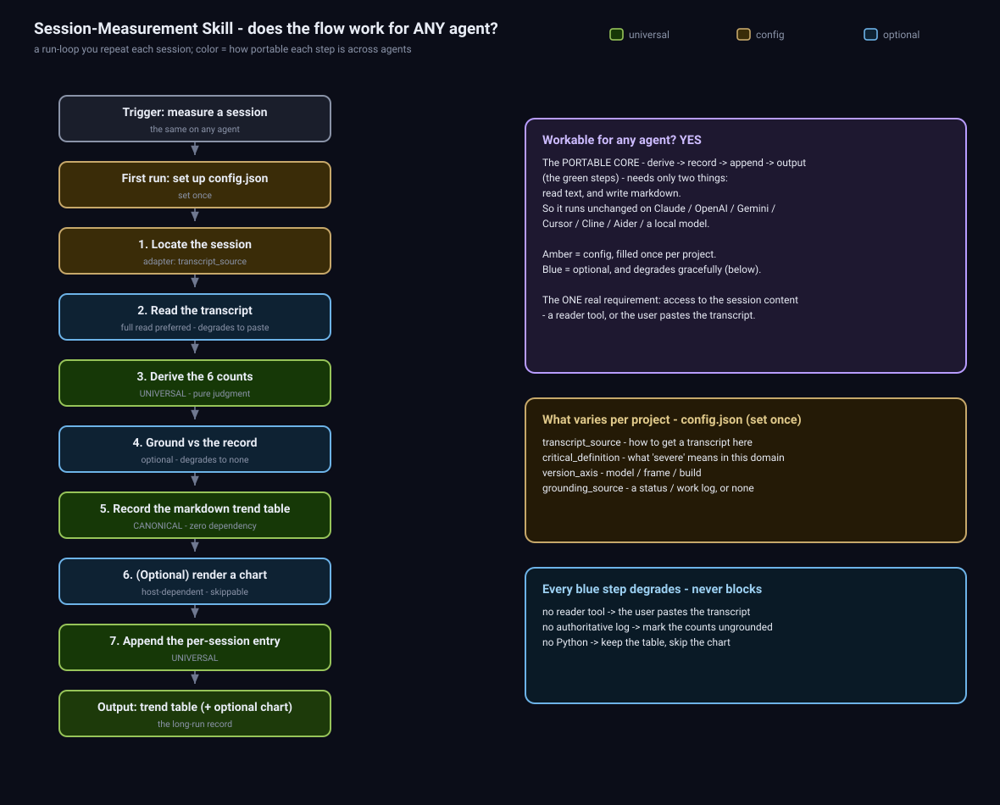

# Session Measurement

✅ Open source (MIT)  ·  ✅ Model-agnostic — runs in any agent

*Score an agent's work session by session, and watch the trend — so a change to the model, the frame, or the skills shows up as better or worse, not just "feels different."*

> A small, agent-agnostic [Whetstone](https://github.com/jovesun-lab/whetstone) skill: turn a finished
> agent session into a row of objective counts, keep them in a running trend table, and read the trend
> over a long run to catch regression or improvement.



---

## The problem

You change something about an AI agent — swap the model, rework its operating frame/scaffolding, add a
skill — and you want to know: **did that actually help, or just feel different?** Vibes don't compound
into evidence. A single session tells you almost nothing; the signal lives in the *trend* across many
sessions, read against what changed.

## What it is

A stable, small **metric frame** + the **counting disciplines** that keep the numbers honest + a
**plain-markdown trend table** that is the canonical record. Run it every session and the table becomes
a long-run benchmark you read across versions.

Six counts per session (green = strength, higher is better; red = weakness, higher is worse):

| Metric | Color | Counts |
|---|---|---|
| Redefinitions absorbed | green | the task was redefined and the agent folded it in **without dropping** earlier constraints |
| Clarifying gates raised | green | the agent **asked** instead of guessing on a genuine ambiguity |
| Errors the agent self-caught | green | flaws caught in its **own** output before the human |
| Misses the human caught | red | misses the human had to send back |
| Critical bugs — agent caught | green | **severe** defects the agent caught itself |
| Critical bugs — human caught | red | severe defects that slipped to the human |

Plus two attributes per session — **version** (which model/frame/build it ran on — so trouble reads
against version) and **MAIN landed** (`L`/`P`/`N` — did the session's main goal land) — and one
optional third, **strain tier at wrap** (`Healthy…Danger`, from the [strain](../strain) skill, so the
trend can answer "do bad sessions correlate with running long?").

`L`/`P`/`N` is the same verdict vocabulary [Throughline](../handoff-skill/throughline) uses to close
goals (`LANDED / PARTIAL / NOT-LANDED`, frozen title, evidence attached) — if the project writes
Throughline handoffs, the Done section's verdicts are a ready-made grounding source for this column.

**"Critical" = severe, not a craft nit.** Defaults: a committed task silently forgotten; a
previously-fixed bug recurring 2+ times; a bug that breaks a working feature (dead-loop). Each project
extends this in config. Hold the bar high or the critical rows stop meaning anything.

## Why it's built this way

- **The markdown table is the measurement — not the chart.** A plain-text trend table needs no code, no
  dependencies, and works on *any* agent, even one that can't execute code. An optional helper script
  (`tools/render_benchmark.py`, Python + cairosvg) renders bar charts and a styled trend image, but it's
  presentation, never the data. No Python? Skip it — keep the table, or have the agent emit inline SVG.
- **Agent-agnostic.** The metric frame, the disciplines, and the markdown output are pure prompt — they
  run as a skill, a slash command, or a pasted-in prompt, on Claude / OpenAI / Gemini / Cursor / Cline /
  a local model. The only thing that varies per project lives in a tiny `config.json` (see below).
- **Honest by construction.** The disciplines are the real value: prefer full reads and flag estimates;
  **never fabricate** a number you can't retrieve (an empty cell beats a made-up one); ground counts
  against an authoritative record instead of trusting a snapshot; and when an agent scores *itself*, the
  human-caught rows are the honesty anchor (they aren't self-reported).
- **Completion that means something.** A raw tasks-done/total rate is ~100% every clean session and
  tells you nothing; **MAIN landed** (did the *goal* land) is the signal that actually varies.

## First run: configure it (once per project)

Create a `config.json` (see `references/config-template.md`). Two ways to fill it:

- **Agent proposes, you supplement (guided).** The agent inspects the project — what transcript source
  is available, what "critical" means for this domain, what the version axis tracks — drafts the config,
  and you confirm or top it up.
- **You provide it.** Hand the values over directly.

```json
{
  "project": "what you're benchmarking (agent + project)",
  "version_axis_label": "what 'version' tracks: model | frame | build | skill-set",
  "transcript_source": "how to get a session transcript here (a reader tool, or 'user pastes it')",
  "critical_definition": "the 3 defaults PLUS your domain's severe defects",
  "grounding_source": "an authoritative record to reconcile against (a work log or status log), or 'none'",
  "exclusions": "session types to skip and why, or 'none'"
}
```

## Use it

1. **Trigger:** "measure that session" / "score how that went" / "track this over time."
2. **Locate + read** the session transcript (full read preferred; a pasted/exported transcript works if
   there's no reader tool).
3. **Derive the six counts** per `references/methodology.md` — you should be able to point at the exact
   moment behind each number.
4. **Ground** against the authoritative record if you have one.
5. **Record** the session's column in the markdown trend table + a short paragraph (what landed, the
   notable catch, the honest miss). This is the canonical output.
6. **(Optional) render a chart** — `python3 tools/render_benchmark.py sessions.json <out_dir>` if you
   have Python + cairosvg, else skip.

The skill body is `skills/session-measurement/SKILL.md` — drop it where your tool reads skills, or paste
it into any agent as a prompt.

## What's in the box

| Path | What it is |
|---|---|
| `skills/session-measurement/SKILL.md` | The skill body (trigger, run loop, metric spine, first-run config). |
| `references/methodology.md` | How to count each metric honestly; the critical definition; the disciplines. |
| `references/config-template.md` | The per-project `config.json` + field notes. |
| `references/log-template.md` | The persistent log structure (trend table + per-session entries). |
| `tools/render_benchmark.py` | **Optional** chart renderer (Python + cairosvg). Reads `sessions.json`. |
| `examples/` | A neutral worked example (a "model swap" story) + a `sessions.json`. |
| `assets/logic-flow.svg` | The diagram above — the flow, color-coded by cross-agent workability. |

## Token footprint

- **Installed, idle:** ~250 tokens — only the trigger description sits in context.
- **Measuring one session:** ~3–6k tokens (skill body + the counts + the markdown row it writes).
- **Optional chart:** 0 model tokens — it's a script.

## License

MIT. Free to use, modify, embed, redistribute.

---

*A [Whetstone](https://github.com/jovesun-lab/whetstone) skill by [arcgram.io](https://arcgram.io).*
